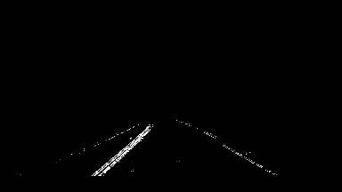
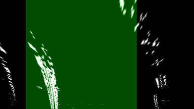
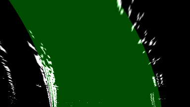

## Lane Finding Project

The Lane Finding project consists of sections.  In the first, a series of calibration images is used to calculate the camera distortion coefficients.  In the second section, these values are applied to undistort images from a forward facing camera and then gradient, thresholding, and regression functions are used to compute the locations of the lane lines.  The location of the lane lines is then used to estimate the vehicle's position in the lane and radius of curvature of the roadway.

### Camera Calibration

The camera calibration pipeline applies a series of OpenCV functions to compute M, the matrix of intrinsic camera parameters, and `dist`, the vector of radial and tangential distortion coefficients.  The set of calibration images depict a chessboard in various orientations against a white background.  To calibrate the camera, the following sequence, illustrated with an example image, is applied to the image set:

  1. The images are loaded with `cv2.imread`.

     

  2.  The images are converted to grayscale using `cv2.cvtColor`.

  

  3.  The chessboard "corners", meaning the internal corners of the checkboard pattern, are located using `cv2.findChessboardCorners`.  The camera calibration is ultimately computed by comparing the found points to what would be expected for a regular pattern, on a flat surface, without any distortion.

  

  4.  After loading all the images and locating the corner points, the function `cv2.calibrateCamera` is applied to the data to compute the cmera matrix M and distortion coefficients.  These values can then be used with the `cv2.undistort` function to correct for camera lens distortion:

  


### Lane Finding

The pipeline for finding lane locations first applies a threshold filter to the gradient values of color transformed images of the road.  Next the image is perspective transformed to replicate an overhead view.  Transformation values are chosen to avoid distortion and replicate a real-world top-down view.  Next, lanes are "fitted" to the prospective lane pixels.

To observe the location of the fitted lanes on the original picture, an overhead image of the fits is distorted back to the original camera perpective and then overlain on the original image.  To this image, calculated radius of curvature and lane position estimates are superimposed.  Details of each step are given below.

#### Isolating Lane Pixels

Images of the roadway are taken from a forward facing camera:

  

First, the previously calculated camera calibration values are used to apply a transformation to adjust for camera distortion. The effects of the undistortion are subtle but have noticible effect at the image boundaries:

  

Next, the image is transformed to the HLS color space using `cv2.cvtColor`.  From an empirical examination of the resulting componets, the lighting and saturation values demonstrate better resiliency to lighting conditions and granular resolution of image features.  The hue component is discarded.  An example of an input image, after distortion correction, is shown here:


Next, the magnitude and direction of the gradient are computed for both the lighting and saturation components.  These values are thresholded using values chosen by empirical examination.  These thresholded pixels are combined with the following logic:
  ```python
  ( saturation_mag & saturation_dir ) | ( lighting_mag & lighting_dir )
  ```
Finally, a mask is applied to the thresholded image to mask all pixels except those on the roadway.  The dimensions of this mask are chosen by examination of input images and chosen to include the expected location of the roadway in the image:

  

#### Perspective Transformation

After isolating thresholding and masking to isolate candidate lane pixels, the image is next perspective shifted to transform the image to an overhead view.  This is accomplished using `cv2.getPerspectiveTransform()` which compute the transformation matrix given 4 sets of corresponding points.  The source points are the 4 points which define the region of interest mask used previously.  Destination points were chosen carefully to preserve the real-world proportions of the region from an overhead view.  In order to approximate this, the destination rectangle was chosen as follows.

  1. The height of the rectangle was chosen to span the height of the destination image (720 pixels).
  2. Using the number of repeating broken stripe markings in the region of interest mask.  From Federal Highway Administration [regulations](https://mutcd.fhwa.dot.gov/htm/2009r1r2/part3/part3a.htm), each pair of paint/gap reptitions should span 40 feet.  Since approximately three repetitions are visible, the area is estimated to span 120 feet.
  3.  Knowing that the destination rectangle heights spans 120 feet using 720 pixels, the destination rectangle width can be calculated by estimating the real world width at the base of the rectangle.  Since roughly half a lane is visible on either side, in addition to the lane in front, this width spans about two lane widths.  Again from the Federal Highway Administration [regulations](https://safety.fhwa.dot.gov/geometric/pubs/mitigationstrategies/chapter3/3_lanewidth.cfm), each lane spans twelve feet so the desination rectangle spans approximately 24 feet.  Therefore to preserve the proper dimensions, the destination rectangle width should be 144 pixels.

Once the source and destination rectangles are defined, the transformation matrix is obtained from `cv2.getPerspectiveTransform()`.  This is applied to the masked gradient image to produce the following top-down view of the candidate lane pixels:

  

#### Lane Fitting

Before fitting, he locations of the pixels are first normalized by taking the Z-score of their X and Y locations.  That is, they are zero-centered by subtracting the mean and then normalized by dividing the standard deviation.  This is applied separtely in the X and Y dimensions.

The lane line location is estimated from the candidate pixels by fitting two polynomial lines.  The row value is treated as the independent variable and the column position is estimated by the regression.  A single set of polynomial coefficients is used to calculate the estimated left lane position.  The right-lane position is then estimated by simply adding the approximate lane width (appropriately scaled).

To fit the lines, L1 loss is computed for each candidate pixel.  Each pixel is compared against the estimated left and right lane line positions.  Only the smaller distance is included.  L1 loss was chosen to decrease the effects of outliers (compared squared loss) since actual lane lines are expected to be strongly collinear.

Trial runs showed a tendency towards convergence at local minima, for example with the left lane fitted to right lane pixels:

  

To overcome this, initial values for the linear and bias terms are computed using a simple algebraic computation.  The mean column locations in the top and bottom 25% of the image are offset by half a lane width. Then a line is fitted to these offset locations using algebra.  The resulting slope and intercept are used as the first and second values of the polynomial coefficients.  Higher order coefficients are initialized to zero.

  

In addition to the loss function, the a gradient function is also computed to improve performance of the optimizer used.  The default optimizer (BFGS) of the scipy.optimize package's `minimize` function is used augmented with the gradient function provided.  The results of the fitted polynomial are drawn:

  

#### Radius of Curvature and Lane Center

The final step is to estimate the lane center and radius of curvature of the road. Because different normalization scaling was applied in the X and Y directions, the polynomial coefficients must be adjusted to compensate and return the values to a common pixel scale.  They are then adjusted again to scale them to a meter scale.

The lane position is calculated by computing the horizontal distance between the image center and the lane.  The lane center is estimated with the mean of the left and right lane esimations in a row corresponding to the area immediately ahead of the vehicle.

Values for the radius of curvature and lane position are the superimposed on the an image with lane position lines.  Lane position lines are obtained by applying the reverse view transformation applied previously.

  

### Discussion

This system takes advantage of important fact that lanes can be reliably expected to be a set distance from each other.  The distance is an approximation since the constant width is actually normal to the lane.  It's not fixed in the horixontal direction of the photo.  As an approximation it still works reasonbly well.

Three improvements would likely substantially improve performance:
* Noise/outlier filtering
* Instead of treating each frame separately, a single frame should apply an update to a function computed in aggregate.
* Adjust loss function to weight near and mid field more heavily, these pixels are effectively a higher resolution depiction of the roadway and should be given more accord than distant pixels.

A video of this pipeline applied to each frame can be found [here](https://youtu.be/EotoMqSttPk)
